<!-- omit in toc -->
# Tello Charger 概要設計書

Tello Chargerの概要設計について記載します。

<!-- omit in toc -->
## 目次

- [1. Telloとは](#1-telloとは)
- [2. 要件定義](#2-要件定義)
  - [2.1. ユースケース図](#21-ユースケース図)
- [3. 機構設計](#3-機構設計)
  - [3.1. アイデアスケッチ](#31-アイデアスケッチ)
  - [3.2. 3DCAD設計](#32-3dcad設計)
- [4. 電気設計](#4-電気設計)
  - [4.1. 回路ブロック図](#41-回路ブロック図)
  - [4.2. 回路図](#42-回路図)
  - [4.3. 基板レイアウト](#43-基板レイアウト)
  - [4.4. 主要部品リスト](#44-主要部品リスト)
- [5. ソフト設計](#5-ソフト設計)
  - [5.1. コンテキスト図](#51-コンテキスト図)
  - [5.2. データフロー図](#52-データフロー図)
  - [5.3. モジュール構造図](#53-モジュール構造図)
  - [5.4. WebAPI仕様](#54-webapi仕様)

## 1. Telloとは

Telloとは、Ryze Tech社が販売している100g以下のトイドローンです。\
ここでは、SDKが公開されているTello EDUを自動充電するための装置を開発します。\
Tello EDU: <https://www.ryzerobotics.com/jp/tello-edu>

## 2. 要件定義

TelloChargerで実現したい要件を定義します。

### 2.1. ユースケース図

以下のユースケースを実現します。

## 3. 機構設計

機構設計について記載します。

### 3.1. アイデアスケッチ

開始当初の自動充電構想です。\
着陸後、中心に寄せて充電プラグを接続するイメージです。

ドローンの位置を中央に寄せる機構と、自動充電プラグを接続する機構のイメージです。\
RCサーボ2軸で簡単に実現する機構にします。

### 3.2. 3DCAD設計

3DCADにて詳細設計を行い、3Dプリンタで印刷します。

アセンブリのSTEPデータは`step/`ディレクトリに保存しています。\
以下は3Dデータに含まれる部品の品番リストです。

| 品番            | 品名（日本語）          | 品名（英語） | 員数 | 備考                                                                                                         |
| --------------- | ----------------------- | ------------ | ---- | ------------------------------------------------------------------------------------------------------------ |
| AILAB21P0001    | メインケース            | MainCase     | 1    |                                                                                                              |
| AILAB21P0002    | カバーA                 | CoverA       | 2    |                                                                                                              |
| AILAB21P0003    | カバーB                 | CoverB       | 4    |                                                                                                              |
| AILAB21P0004    | カバーC                 | CoverC       | 4    |                                                                                                              |
| AILAB21P0006    | サブケース              | SubCase      | 1    |                                                                                                              |
| AILAB21P0007    | アームA                 | ArmA         | 1    |                                                                                                              |
| AILAB21P0008    | アームB                 | ArmB         | 1    |                                                                                                              |
| AILAB21P0009    | アームC                 | ArmC         | 1    |                                                                                                              |
| AILAB21P0010    | スライドレール          | SlideRail    | 1    |                                                                                                              |
| AILAB21P0011    | リンク                  | Link         | 1    |                                                                                                              |
| xmec_PT2.6x12-B | バインドPタイト2.6x12mm | -            | 4    |                                                                                                              |
| xmec_PT2.6x8-B  | バインドPタイト2.6x8mm  | -            | 16   |                                                                                                              |
| xmec_PT2.0x6-B  | バインドPタイト2.0x6mm  | -            | 6    |                                                                                                              |
| xmec_M3x8-N     | M3なべ小ねじx8mm        | -            | 8    |                                                                                                              |
| xmec_NUT-M3     | M3ナット                | -            | 8    |                                                                                                              |
| xmec_takegushi  | 竹串                    | -            | 44   | 着陸ガイドには竹串を使用                                                                                     |
| xele_cable      | マグネットUSBケーブル   | -            | 1    | [購入リンク](https://www.amazon.co.jp/gp/product/B07GQVHP67/ref=ppx_yo_dt_b_asin_title_o04_s00?ie=UTF8&th=1) |

## 4. 電気設計

電気設計について記載します。

### 4.1. 回路ブロック図

回路ブロック図は以下になります。

- マイコンはATOM Liteを採用
- 以下2点の目的で電流センサを搭載する
  - 充電電流を監視し、充電状態を取得する
  - サーボ電流を監視し、過負荷を検知する
- 充電電圧をMOSFETで制御（Telloの電源を入れる目的）

### 4.2. 回路図

回路図を以下に示します。\
Eagleの設計データは`eagle/`ディレクトリに保存しています。

### 4.3. 基板レイアウト

部品の配置図を示します。

### 4.4. 主要部品リスト

主要部品のリストを以下に示します。

| No. | 品名              | 型番                             | 個数 | 参考URL                                         |
| --- | ----------------- | -------------------------------- | ---- | ----------------------------------------------- |
| 1   | ATOM Lite         | ATOM Lite                        | 1    | <https://www.switch-science.com/products/6262>  |
| 2   | RCサーボ          | GWSMIRMGFA                       | 2    | <https://akizukidenshi.com/catalog/g/gM-01908/> |
| 3   | 電流センサ        | INA219使用電流センサーモジュール | 1    | <https://akizukidenshi.com/catalog/g/gM-08221/> |
| 4   | USB-A DIP化       | AE-USB-A-DIP                     | 1    | <https://akizukidenshi.com/catalog/g/gK-07429/> |
| 5   | USB-C DIP化       | AE-USB2.0-TYPE-C-CTRPB-1         | 1    | <https://akizukidenshi.com/catalog/g/gK-17123/> |
| 6   | Nch MOSFET        | 2SK4017(Q)                       | 1    | <https://akizukidenshi.com/catalog/g/gI-07597/> |
| 7   | フェライトビーズ  | BLM18RK121SN1D                   | 1    | <https://akizukidenshi.com/catalog/g/gP-04445/> |
| 8   | チップ抵抗        | 1608 10kΩ                        | 1    |                                                 |
| 9   | ピンヘッダ 1x5    | PH-1x40SG                        | 1    | <https://akizukidenshi.com/catalog/g/gC-00167/> |
| 9   | ピンヘッダ 1x4    | PH-1x40SG                        | 1    | <https://akizukidenshi.com/catalog/g/gC-00167/> |
| 9   | ピンヘッダL型 2x3 | PH-2x10RG                        | 1    | <https://akizukidenshi.com/catalog/g/gC-10903/> |
| 10  | ピンソケット 1x6  | FH-1x6SG/RH                      | 適量 | <https://akizukidenshi.com/catalog/g/gC-03784/> |

## 5. ソフト設計

ATOM Liteに書き込むファームウェアの設計内容を記載します。

### 5.1. コンテキスト図

以下にコンテキスト図を記載します。

### 5.2. データフロー図

以下にデータフロー図を記載します。

### 5.3. モジュール構造図

以下にモジュール構造図を記載します。

### 5.4. WebAPI仕様

TelloChargerは上位システムからの充電指示をWebAPIで受け付けるようにします。\
以下にWebAPI仕様を記載します。

[Tello Charger API](../openapi/api.html)
