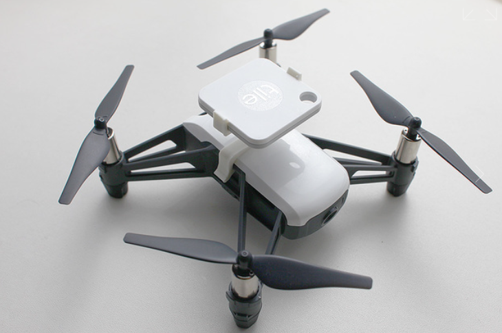

# ドローン制御システム自由研究

## 自動充電

### Fusion360で平歯車の作成

ツール⇒アドイン⇒スクリプトとアドイン⇒Spur Gear（下側）
https://www.fact-cam.co.jp/product/2019/10/fusion360/archives/000447.html

## GPS

### telloにtileを付けた事例

https://www.thingiverse.com/thing:2943670

## センサ追加

| 品名                                                     | 価格 | URL                                          |
| -------------------------------------------------------- | ---- | -------------------------------------------- |
| TVOC/eCO2 ガスセンサユニット（SGP30）                    | 1606 | https://www.switch-science.com/products/6619 |
| M5Stack用 温湿度CO2センサ（SCD41）                       | 7117 | https://www.switch-science.com/products/8668 |
| ATOM Motionキット モーター/サーボドライバ（STM32F0搭載） | 3553 | https://www.switch-science.com/products/6993 |
| ATOMS3 Lite                                              | 1386 | https://www.switch-science.com/products/8778 |

## PlatformIOを使ってみる

### PlatformIOのインストール

以下のURLを参考にPlatformIOをインストールします。\
<https://takabus.com/tips/2402/>

1. VSCodeをインストールする
1. PlatformIOの拡張機能をインストールする
1. プロジェクトを新規作成する
1. 今回はATOM Liteを使用するため、Bord: M5Stack-ATOM を選択する

### ライブラリのインストール

PlatformIOのLibrariesから以下をインストールする

1. M5Atom
1. FastLED

## サンプルプログラムの実行

以下のLチカプログラムを実行する

~~~cpp
#include <M5Atom.h> //Atomのヘッダファイルを準備
//FastLED（CRGB構造体）設定
CRGB dispColor(uint8_t r, uint8_t g, uint8_t b) {
  return (CRGB)((r << 16) | (g << 8) | b);
}
// 初期設定 -----------------------------------------------
void setup() {
  // 本体初期化（UART有効, I2C無効, LED有効
  M5.begin(true, false, true);
  // LED全消灯（赤, 緑, 青)
  M5.dis.drawpix(0, dispColor(0, 0, 0));
}
// メイン -------------------------------------------------
void loop() {
  M5.update(); //本体のボタン状態更新
  if (M5.Btn.isPressed()) {  //ボタンが押されていれば
    M5.dis.drawpix(0, dispColor(0, 0, 255)); //LED（指定色）
  } else { //ボタンが押されてなければ
    M5.dis.drawpix(0, dispColor(20, 20, 20)); //LED（白）
  }
  delay(100); //100ms待機
}
~~~